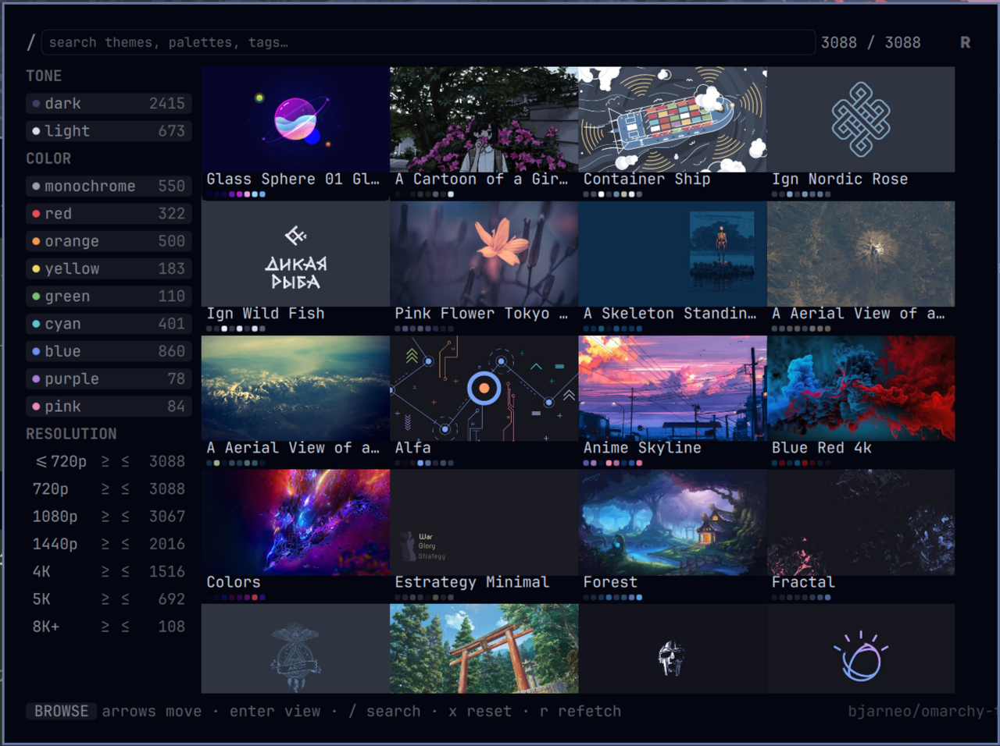

# Themes Gallery — gotar.omarchy-themes

Center-bar gallery for **[bjarneo/omarchy-themes](https://bjarneo.github.io/omarchy-themes/)** — 3,088 wallpapers, each with five theme variants (Palette · Warm · Cool · Material · Aether).

Browse, search and preview like on the website, then apply any variant as a native Omarchy theme in one click. Lives in the center of the bar right after the weather widget (🖼️).



- **Search** (path + title + tags, debounced, same as site)
- **Filters with live counts**: tone (`dark`/`light`), color (9 hues), resolution tier range `≥`/`≤` (720p → 8K+)
- **4× grid** of thumbnails (throttled, async) with palette dots
- **Detail**: large preview + extracted palette + tags + 5 variants with 16-color ANSI ramps → **Apply** per variant
- **One-click apply**: `bin/apply-theme.py` fetches `colors.toml` and the wallpaper from `wallpapers.hel1.your-objectstorage.com`, writes atomically to `~/.config/omarchy/themes/<slug>/` (`colors.toml` + `backgrounds/`), then `omarchy theme set <slug>`. Re-apply is idempotent. If the theme background is private (403) it falls back to the original wallpaper automatically.

## Install

```sh
omarchy plugin add https://github.com/gotar/omarchy-themes.git --enable
omarchy bar put gotar.omarchy-themes --after omarchy.weather
# or: omarchy bar put gotar.omarchy-themes --section center
```

Alternative: clone to `~/.config/omarchy/plugins/gotar.omarchy-themes/` then `omarchy-shell shell rescanPlugins`.

Adds 🖼️ to the bar. Left-click opens the gallery, **right-click opens Aether**.

## Use

| Mouse / Key | Action |
|---|---|
| **Left click 🖼️** | Open / close gallery |
| **Right click 🖼️** | Open **Aether** (`aether`) |
| Click card / `Enter` | Open detail |
| `← →` / `↑ ↓` | Browse wallpapers / cycle variant |
| `Enter` in detail | Apply selected variant |
| `Esc` | Back / close |
| `/` | Focus search |
| `x` | Reset all filters |
| `r` | Re-fetch index (bypass 24 h cache) |
| `Tab` | Switch to prev/next open panel |

Hover + click everywhere: facets, cards, variant rows, breadcrumbs, search.

### Random & Auto

- **🔀 Shuffle** (header, next to `R`) or `Apply Random` in the `AUTO` filter section — picks a random wallpaper from the *currently filtered* set and applies it (variant + wallpaper in Theme mode, only wallpaper in Wallpaper mode).
- **AUTO** — filter rail `AUTO` lets you pick `Off · 5m · 15m · 30m · 60m`. When on, a `Timer` fires every interval and calls the same random logic, even while the gallery is closed (the `Panel` root stays loaded via the bar widget). Great for a live wallpaper rotation that respects your tone/color/resolution filters. Set `AUTO 15m` + `dark + green + ≥5K` and you get a fresh dark-green 5K wallpaper every quarter hour.
- **Wallpaper only** — filter rail `MODE` toggle `Theme ↔ Wallpaper`. In `Wallpaper` mode `Apply` (and random) only sets the image via `bin/set-wallpaper.py` + `omarchy-theme-bg-set` without touching `colors.toml`/theme — ideal if you love your current theme colors and just want the image.

## How it works

- **Index**: first open runs `bin/fetch-manifest.py` → downloads ~35 MB `https://bjarneo.github.io/omarchy-themes/wallpapers.js` (`window.WALLPAPERS` + `WALLPAPERS_BASE_URL`), slims to ~7 MB JSON (`p/t/tone/color/tags/w/h/thumb/med/pal/th{5×{n,ct,bg,c[16]}}`) and caches to `~/.cache/gotar.omarchy-themes/manifest.json` (24 h TTL). Subsequent opens read cache instantly.
- **Thumbnails / previews**: `Image { asynchronous:true; cache:false }` from the same bucket (`thumb_path`, `medium_path`, `p`).
- **Apply**: `bin/apply-theme.py <slug> <base> <ct> <bg> [fallbackP]` → `try_download(ct)` → `try_download(bg)` → fallback to `p` on 403 → write. Panel then `Process { command: ["omarchy","theme","set",slug] }`. Current theme shown via `omarchy theme current` → highlighted `active` pill.

No extra network beyond index + media.

## Layout

```
manifest.json          id gotar.omarchy-themes, kind bar-widget, on-demand, center
BarWidget.qml          🖼️ JetBrainsMono Nerd Font button, left=toggle, right=Aether, header 🔀 random
Panel.qml              900×640 KeyboardPanel + PanelKeyCatcher, search (dark translucent), filter rail (TONE/COLOR/RESOLUTION + MODE Theme/Wallpaper + AUTO Off/5/15/30/60), GridView, detail, IpcHandler, auto Timer, wallpaperProc
Model.js               .pragma library — bucketRes, prep, apply, variant helpers, titleCase
bin/fetch-manifest.py  wallpapers.js → slim manifest → cache
bin/apply-theme.py     colors + background (with fallback med→p) → theme (detached, panel closes first to avoid Hyprland freeze)
bin/set-wallpaper.py   wallpaper only → cache → omarchy-theme-bg-set
```

Window is `fittedContentWidth(900)` × `fittedContentHeight(640)` so the 4-column grid and detail (½ image + palette/tags + 5 ramps) breathe. Search field is dark translucent (`Qt.alpha(Color.background,0.32)` → `0.55` on focus) with subtle border.

## Credits & license

- **Wallpapers & themes**: [bjarneo/omarchy-themes](https://github.com/bjarneo/omarchy-themes) & [bjarneo.github.io/omarchy-themes](https://bjarneo.github.io/omarchy-themes/) — all images and `colors.toml` / `background` mappings are theirs, served from `wallpapers.hel1.your-objectstorage.com` (Hetzner Object Storage, hel1). Thank you!
- **Aether**: theme generator that produced the five variants per wallpaper.
- **Omarchy**: shell, `omarchy theme set/current`, `Style`/`Color`/`Border`, `Panel`/`KeyboardPanel`/`PanelKeyCatcher` APIs.
- **Quickshell**: `Quickshell.Io/Process` + `StdioCollector`.

This plugin is **MIT** (see `LICENSE`). Wallpapers remain under their original licenses as provided by the upstream collection. This project is open-source, no telemetry, no tracking.

## Publish

Validates with `omarchy plugin validate` and `qmllint`. To list on the marketplace see [omarchyplugins.com/publish.html](https://omarchyplugins.com/publish.html) → submit the repo at [HANCORE-linux/omarchy-plugin-marketplace — Submit a plugin](https://github.com/HANCORE-linux/omarchy-plugin-marketplace/issues/new?template=submit-plugin.yml) (`Public GitHub repository` + valid `manifest.json`).

## Dev

```sh
omarchy plugin validate ./
python3 -m py_compile bin/*.py
qmllint -I /usr/share/omarchy/shell -I /usr/lib/qt6/qml Panel.qml BarWidget.qml
omarchy-shell shell rescanPlugins  # hot-reload
grim /tmp/preview.png               # after summon
```
